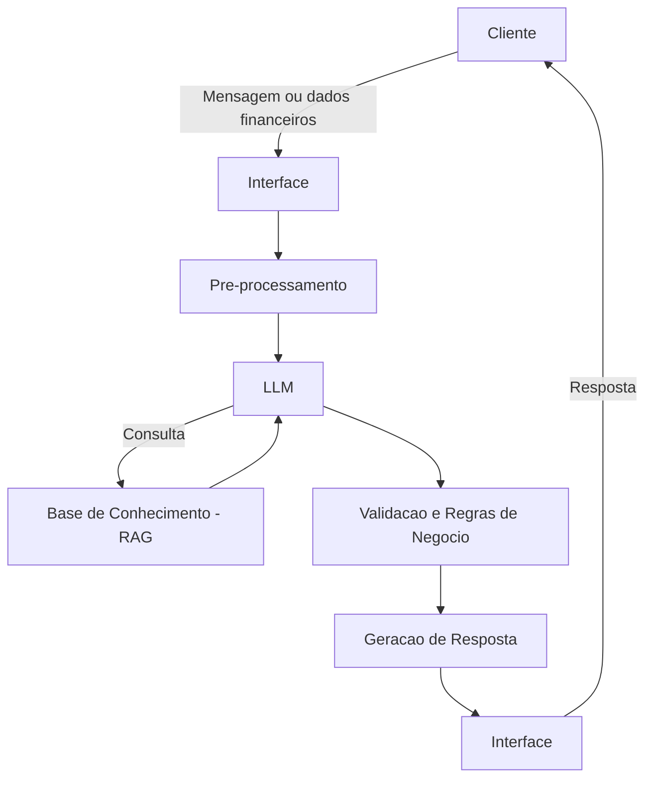

# Documentação do Agente

## Caso de Uso

### Problema
> Qual problema financeiro seu agente resolve?

O agente resolve a falta de clareza e controle sobre a vida financeira pessoal, que leva a:
- Gastos desorganizados e acima da renda
- Dificuldade em poupar dinheiro
- Ausência de planejamento financeiro
- Decisões financeiras mal informadas
- Endividamento ou risco de endividamento

### Solução
> Como o agente resolve esse problema de forma proativa?

O agente resolve o problema de forma proativa ao acompanhar continuamente os dados financeiros, identificar padrões e riscos, antecipar cenários e sugerir ações antes que o usuário perceba o problema, atuando como um consultor financeiro ativo e não apenas reativo.
  
### Público-Alvo
> Quem vai usar esse agente?

- Pessoas físicas (principalmente iniciantes/intermediários em educação financeira)
- Profissionais que querem organizar melhor suas finanças
- Pessoas endividadas ou com dificuldade de poupar
- Usuários que já usam planilhas, mas não sabem analisar os dados

---

## Persona e Tom de Voz

### Nome do Agente
FinanIA

### Personalidade
> Como o agente se comporta? (ex: consultivo, direto, educativo)

Consultivo, educativo e prático.
Explica de forma simples, orienta o usuário passo a passo e sempre sugere ações claras para melhorar a situação financeira.

### Tom de Comunicação
> Formal, informal, técnico, acessível?

Acessível e didático, com linguagem simples e direta.
Evita termos técnicos e, quando necessário, explica de forma fácil de entender.

### Exemplos de Linguagem
- Saudação: "Oi! Vamos dar uma olhada nas suas finanças juntos?"
- Confirmação: "Entendi! Vou analisar isso e já te explico de forma simples."
- Erro/Limitação: "Ainda não tenho informações suficientes pra te dar uma resposta mais precisa. Se puder me contar mais detalhes, consigo te ajudar melhor."
  
---

## Arquitetura

### Diagrama

### Componentes

| Componente           | Descrição                                                                                  |
| -------------------- | ------------------------------------------------------------------------------------------ |
| Interface            | Chat em Streamlit onde o usuário envia suas informações financeiras                             |
| LLM                  | Modelo executado localmente via Ollama (ex: Llama 3), responsável por gerar as respostas   |
| Base de Conhecimento | Dados do usuário e conteúdos básicos de educação financeira em arquivos simples (CSV/JSON) |
| Validação            | Verificações simples para garantir que as respostas façam sentido com os dados informados  |

---

## Segurança e Anti-Alucinação

### Estratégias Adotadas

- [ ] Responde apenas com base nos dados do usuário
- [ ] Informa quando não tem dados suficientes
- [ ] Evita recomendações financeiras específicas sem contexto
- [ ] Verifica se as respostas fazem sentido com os dados informados

### Limitações Declaradas
> O que o agente NÃO faz?

- Não substitui um consultor financeiro profissional
- Não realiza recomendações específicas de investimento
- Depende da qualidade e completude dos dados fornecidos pelo usuário
- Pode gerar estimativas que não refletem exatamente a realidade futura
- Não acessa dados bancários reais automaticamente
